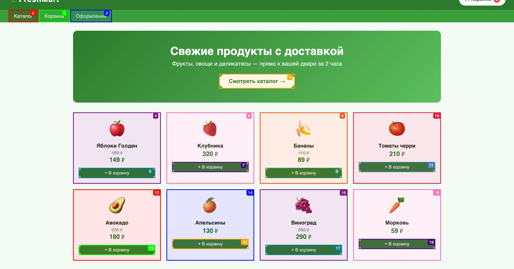

# Гайд: записать пошаговое руководство по доступу к сайту
Сайт: http://localhost:8099/freshmart/

## Шаг 1

[Блок 1] Перейдите по адресу «http://localhost:8099/freshmart/» для начала работы.

## Шаг 2

[Блок 2] Нажмите на «Яблоки», чтобы открыть раздел с этой категорией товаров.

## Шаг 3

[Блок 3] Нажмите кнопку «Смотреть каталог», чтобы увидеть все продукты.

## Шаг 4

[Блок 4] Нажмите кнопку «Подтвердить заказ», расположенную внизу экрана.

## Шаг 5

[Блок 5] Нажмите кнопку «Смотреть каталог», чтобы увидеть все продукты.

## Шаг 6

[Блок 6] Нажмите кнопку «Смотреть каталог», чтобы увидеть продукты.
